# 🌟 **ESP32_TinyML – Inferência de Redes Neurais no ESP32-S3**

<p align="left">
  
  
  
  
  
  
  
  
 
</p>

**Uma solução completa de Edge AI (TinyML) com TensorFlow Lite Micro**

**Autor:** *Kelton Martins Dias*<br>
**Orientador:** *Prof. Felipe Mota*

---

## 📌 **Sumário**

1. [Introdução](#-1-introdução)
2. [Objetivo do projeto](#-2-objetivo-do-projeto)
3. [Arquitetura geral](#-3-arquitetura-geral)
4. [Estrutura do repositório](#-4-estrutura-do-repositório)
5. [Requisitos](#-5-requisitos)

   * [Hardware](#-hardware)
   * [Software](#-software)
6. [Preparação do ambiente (VS Code + ESP-IDF)](#-6-preparação-do-ambiente-vs-code--esp-idf)
7. [Instalando o TensorFlow Lite Micro no ESP-IDF](#-7-instalando-o-tensorflow-lite-micro-no-esp-idf)
8. [Processo completo: Keras → TFLite → TFLite Micro → C/C++](#-8-pipeline-completo-keras--tflite--c-para-esp32-s3)

   * [Treinamento do modelo](#81-treinamento-do-modelo-keras)
   * [Fine-tuning](#82-comparação-das-arquiteturas-resumo)
   * [MobileNetV2 vs MobileNetV3 vs modelo customizado](#82-comparação-das-arquiteturas-resumo)
   * [Conversão para TFLite](#83-conversão-para-tflite)
   * [Quantização (INT8)](#84-quantização-int8-fundamental-para-microcontroladores)
   * [Geração do modelo estático para C](#86-converter-para-c-array-usado-no-esp-idf)
9. [Compilar, fazer flash e monitorar no ESP32-S3](#-9-build-flash-e-monitor)
10. [Uso da memória, arena e otimizações](#-10-memória-arena-e-otimizações)
11. [Limitações importantes](#-11-limitações-importantes)
12. [Boas práticas](#-12-boas-práticas)
13. [Links úteis](#-13-recursos-e-links-úteis)
14. [Licença](#-14-licença)

---

# ✨ **1. Introdução**

Este projeto demonstra, de forma completa e didática, como levar um modelo de **Deep Learning** — treinado com **TensorFlow/Keras** — para execução totalmente embarcada no **ESP32-S3**, sem internet e sem depender de servidores ou aceleração externa.

Utiliza-se o **TensorFlow Lite Micro**, adaptado pela Espressif via o componente:

> **esp-tflite-micro** (versão recomendada: **v1.3.5**)

Com isso, é possível realizar inferências de modelos CNN diretamente no microcontrolador, mesmo com recursos extremamente limitados.

Este repositório apresenta:

✓ Código-fonte completo em C/C++ para ESP-IDF<br>
✓ Modelos treinados (MobileNetV2, MobileNetV3 e modelo customizado)<br>
✓ Arquivos `.tflite` (normal, quantizado, dinâmico*)<br>
✓ Conversão para C array (`model_data.cc`)<br>
✓ Notebooks de treinamento<br>
✓ Análises de desempenho e memórias<br>

---

# 🎯 **2. Objetivo do projeto**

O objetivo é fornecer **um pipeline completo**, replicável e totalmente funcional, para:

* Treinar um modelo CNN (do zero ou fine-tuning)
* Comparar arquiteturas adequadas para microcontroladores
* Converter para TFLite e otimizar via quantização
* Gerar modelos compatíveis com TFLite Micro
* Executar inferência no ESP32-S3 com baixo consumo de RAM
* Fazer toda a integração em C/C++ com ESP-IDF

É um guia completo de TinyML aplicado **na prática**.

---

# **3. Arquitetura geral**

```mermaid
graph LR
A[Treinamento Keras] --> B[Conversão .tflite]
B --> C[Quantização INT8]
C --> D[Conversão Hex xxd]
D --> E[Firmware C++ ESP-IDF]
E --> F[Inferência no ESP32-S3]
```



---

# 📂 **4. Estrutura do repositório**

```
ESP32_TinyML
├── Esp32S3                  # Firmware principal (ESP-IDF Project)
│   ├── CMakeLists.txt
│   └── main
│       ├── CMakeLists.txt
│       ├── idf_component.yml # Gerenciador de dependências (TFLM)
│       ├── main.cpp          # Entry point (app_main)
│       ├── main_functions.cc # Setup do TFLite e Loop de inferência
│       ├── model.h           # Cabeçalho do modelo
│       └── model_data.cc     # Modelo treinado convertido em byte array
├── Modelos                  # Arquivos .keras e .tflite gerados
│   ├── Customizado
│   ├── V2 (MobileNetV2)
│   └── V3 (MobileNetV3)
├── Treinamento              # Jupyter Notebooks
│   ├── CNN_Lite.ipynb       # Notebook completo
│   └── CNN_Lite_limpo.ipynb # Versão otimizada para visualização
└── LICENSE
```

---

# **5. Requisitos**

## 🔌 **Hardware**

* ESP32-S3 DevKitC-1 (recomendado)
* Cabo USB
* Opcional: câmera, sensores etc.

---

## 🖥️ **Software**

* **VS Code**
* **Extensão ESP-IDF**
* ESP-IDF (versão 4.x ou 5.x compatível com esp-tflite-micro)
* Python 3.8+
* TensorFlow ≥ 2.6 (recomendado 2.6 para compatibilidade total)
* Ferramenta `xxd` (Linux/macOS) para gerar arquivos C
* Git

---

# ⚙️ **6. Preparação do ambiente (VS Code + ESP-IDF)**

1. Instale o VS Code
2. Instale a extensão **Espressif IDF**
3. Configure o ESP-IDF pelo assistente da própria extensão
4. Abra a pasta `ESP32_TinyML/Esp32S3`
5. Caso esteja no terminal, ative manualmente:

```bash
source $IDF_PATH/export.sh
```

---

# 📦 **7. Instalando o esp-tflite-micro**

O componente oficial utilizado:

🔗 [https://github.com/espressif/esp-tflite-micro/tree/v1.3.5](https://github.com/espressif/esp-tflite-micro/tree/v1.3.5)

Instalação automática no projeto:

```bash
idf.py add-dependency "esp-tflite-micro"
```

O próprio ESP-IDF baixa e instala o componente.

---

# 🧠 **8. Pipeline completo: Keras → TFLite → C para ESP32-S3**

## 8.1 Treinamento do modelo (Keras)

Pode ser feito:

* **Do zero** (modelo customizado, leve e muito eficiente)
* **Fine-tuning** usando:

  * MobileNetV2
  * MobileNetV3
  * Outras arquiteturas suportadas

Os notebooks deste projeto mostram:

* Aumento de dados
* Mixed precision
* Estratégias de regularização
* Comparativo entre modelos

---

## 8.2 Comparação das arquiteturas (resumo)

### **MobileNetV2**

* Excelente equilíbrio entre tamanho e acurácia
* Funciona muito bem após quantização

### **MobileNetV3**

* Excelente para dispositivos móveis
* No TinyML, a conversão + quantização pode causar **queda de desempenho**, dependendo das operações utilizadas
* Não é um problema da arquitetura, mas sim da compatibilidade e forma como algumas camadas são quantizadas

### **Modelo Customizado**

* O melhor para ESP32-S3
* Controle total sobre profundidade, filtros, entrada
* Geralmente exige muito menos arena TFLM

---

## 8.3 Conversão para TFLite

Conversão simples:

```python
converter = tf.lite.TFLiteConverter.from_keras_model(model)
tflite = converter.convert()
open("modelo_normal.tflite", "wb").write(tflite)
```

---

## 8.4 Quantização INT8 (fundamental para microcontroladores)

A quantização reduz:

* Tamanho do arquivo
* Consumo de RAM
* Tamanho da arena TFLM

Exemplo:

```python
converter.optimizations = [tf.lite.Optimize.DEFAULT]
converter.representative_dataset = representative_data_gen
converter.target_spec.supported_ops = [tf.lite.OpsSet.TFLITE_BUILTINS_INT8]
converter.inference_input_type = tf.int8
converter.inference_output_type = tf.int8
```

---

## 8.5 Sobre modelos dinâmicos

Modelos "dinâmicos" (com tensores alocados em tamanho variável ou operadores que exigem realocação) **não são suportados pelo TFLite Micro**.

Mesmo que suas métricas sejam calculadas, **não podem ser usados no ESP32-S3**.

No repositório, eles foram mantidos apenas para fins de comparação.

---

## 8.6 Converter para C Array (usado no ESP-IDF)

```bash
xxd -i modelo_inteiro.tflite > model_data.cc
```

Depois, basta adicionar no código:

```c
#include "model_data.cc"
```

E referenciar no `model.h`.

---

# 🛠️ **9. Build, Flash e Monitor**

Na pasta `Esp32S3`:

```bash
idf.py menuconfig
idf.py build
idf.py -p /dev/ttyUSB0 flash
idf.py -p /dev/ttyUSB0 monitor
```

Sair do monitor:
`CTRL + ]`

Também é possível usar os botões do ESP-IDF dentro do VS Code.

---

# 💾 **10. Memória, arena e otimizações**

Com base em medições reais feitas no ESP32-S3:

### **SRAM interna livre (~361 KB)**

* Maior bloco contíguo (~303 KB)

### **Arena ideal estimada: 280–290 KB**

A arena precisa ser contígua.
Modelos maiores falham mesmo se houver RAM livre.

### **Dicas de otimização**

* Use **quantização INT8**
* Reduza o tamanho de entrada do modelo
* Diminua número de filtros
* Evite camadas complexas
* Pruning e distillation podem ser úteis

---

# ⚠️ **11. Limitações importantes**

* **Modelos Dinâmicos** → não funcionam no TFLM
* MobileNetV3 pode apresentar **queda de desempenho após conversão**
* O ESP32-S3 não suporta operadores avançados do TensorFlow
* A arena deve estar **inteira na SRAM interna**

---

# 📘 **12. Boas práticas**

* Sempre teste a acurácia **após** a conversão para TFLite
* Gere um representative dataset variado
* Monitore o uso de heap no log do ESP-IDF
* Use PSRAM apenas para buffers auxiliares, não para arena
* Evite modelos acima de ~350 KB (tflite) se não forem quantizados

---

# 🔗 **13. Recursos e links úteis**

* **esp-tflite-micro (1.3.5):**
  [https://github.com/espressif/esp-tflite-micro/tree/v1.3.5](https://github.com/espressif/esp-tflite-micro/tree/v1.3.5)

* **Documentação ESP-IDF:**
  [https://docs.espressif.com](https://docs.espressif.com/projects/esp-idf/en/latest/esp32/get-started/index.html)

* **Conversão TFLite:**
  [https://www.tensorflow.org/lite/convert](https://www.tensorflow.org/lite/convert)

* **Link de Compra**
   [https://www.makerhero.com/produto/placa-esp32-s3-devkitc/:](https://www.makerhero.com/produto/placa-esp32-s3-devkitc/)

---

# 📄 **14. Licença**

Veja o arquivo `LICENSE` na raiz do projeto.

---